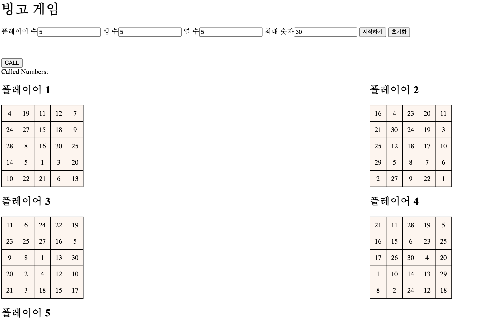
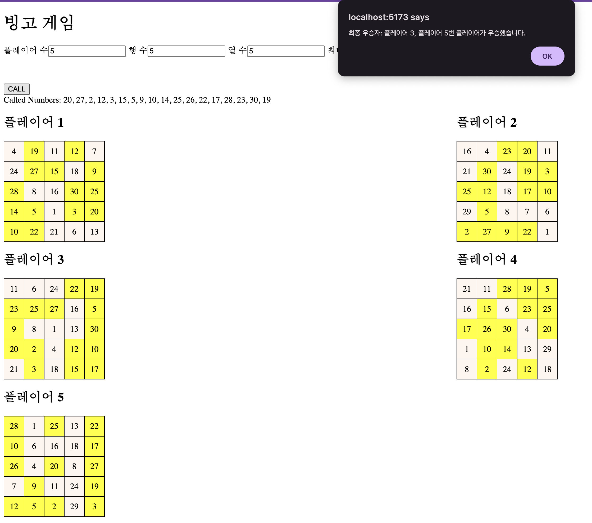

# Bingo Game
- 사용자는 게임 파라미터를 설정하고 게임을 시작하면, 번호가 호출되고 플레이어들의 보드가 실시간으로 업데이트되는 React 기반 빙고 게임입니다.

## 컴포넌트
### 1. BingoGame
- 간단한 React 빙고 게임으로 플레이어 수, 행 수, 열 수, 최대 숫자를 입력하여 보드판을 생성합니다.

### 2. Player
- 각 플레이어의 보드판을 생성하고, 중복되지 않은 번호로 보드판을 채웁니다.
- 가로, 세로, 대각선을 확인하여 빙고인지 검사합니다.

### 3. Board & Tile
- 플레이어가 갖는 보드판, 보드판을 구성하는 타일 컴포넌트입니다.

### 4. Refree
- 최대 숫자 범위 내 숫자들을 무작위로 선정합니다. 플레이어들은 Refree가 호출한 번호를 가지고 빙고를 합니다.

### 5. WinningChcker
- 게임에서 승리한 플레이어들을 알려줍니다. 
