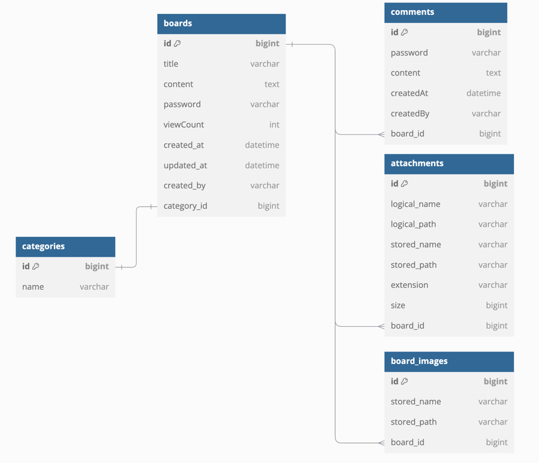
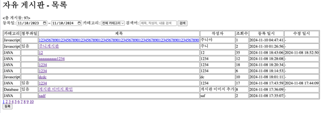
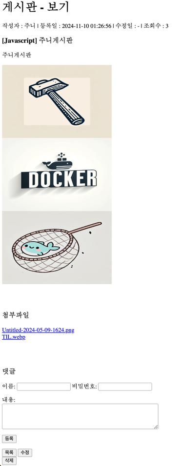
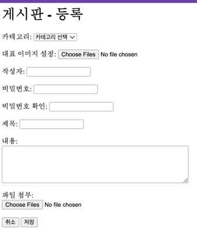
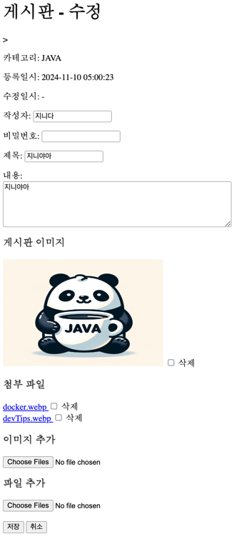

# Servlet 과 순수 JDBC를 이용한 게시판 (스프링 X)

## ERD

- https://dbdiagram.io/d/ebstudy-week1-67283e01b1b39dd85859487e

## 기능 - 게시판 CRUD
- 게시판 목록, 상세 기능
- 게시판 생성, 수정, 삭제 기능
- 댓글 생성 기능
- 게시판 생성, 수정, 삭제 등 입력 유효성 검증 (프론트, 백엔드)
- 트랜잭션 고려, 디자인 패턴 고려(커맨드 패턴, 팩토리 메서드 패턴)
 
### 게시판 목록 페이지

- 페이징 처리, 검색어 파라미터 처리
  - **검색을 하고, 페이지를 이동했을 때 검색 정보가 유지**되어야 한다. (URL로 상태 추적)

### 게시판 상세 페이지

- 작성자, 등록일, 수정일 등 게시글 기본 정보 표시
- 게시글 이미지 파일 등록 가능
- 첨부 파일 등록 가능(클릭하면 다운로드)
- 댓글 작성 가능

### 게시글 등록 페이지

- 입력 값 유효성 검증 로직(프론트, 백)

### 게시글 수정 페이지

- 파일 일부 삭제, 추가 가능

### ETC
- 게시글 삭제 페이지, 비밀번호 확인 페이지 등

## 디자인 패턴(커맨드, 팩토리 메서드)
```java
public interface BoardController {

  public void execute(HttpServletRequest req, HttpServletResponse res)
      throws ServletException, IOException;
}
```
```java
@WebServlet(urlPatterns = "/boards/*")
public class BoardDispatcherServlet extends HttpServlet {

  /**
   * /boards 로 시작하는 모든 요청을 처리하는 서블릿 컨트롤러가 사용하는 구현체 직접 생성하여 BoardControllerFactory 전달
   * ControllerResolver 로부터 실행할 컨트롤러를 넘겨받아 실행하는 역할
   *
   * <p>필드 주입에서 생성자 주입 방식으로 변경하고, 컨트롤러 인스턴스 생성을 Factory 객체에게 위임 요청 URL 해당하는 컨트롤러를 찾는 로직은
   * ControllerResolver 객체에게 위임
   *
   * @param config
   * @throws ServletException
   */
  @Override
  public void init() throws ServletException {
    super.init(config);

    BoardDAO boardDAO = new BoardDAOImpl();
    CategoryDAO categoryDAO = new CategoryDAOImpl();
    BoardValidator validator = new BoardValidator();

    BoardControllerFactory factory = new BoardControllerFactory(categoryDAO, boardDAO, validator);
    this.controllerResolver = new BoardControllerResolver(factory);

    getServletContext().setAttribute("boardControllerFactory", factory);
  }
  
  @Override
  protected void service(HttpServletRequest request, HttpServletResponse response)
          throws ServletException, IOException {

    String requestURI = request.getRequestURI();
    BoardController controller = controllerResolver.resolveController(requestURI);

    if (controller == null) {
      throw new RuntimeException(ErrorMessage.NO_HANDLER_MSG + request.getRequestURI());
    }
    controller.execute(request, response);
  }
}
```
```java
public class BoardControllerResolver {

  private final Map<String, BoardController> exactMappings;
  private final Map<Pattern, BoardController> regexMappings;

  public BoardControllerResolver(BoardControllerFactory factory) {
    this.exactMappings = factory.createExactMappings();
    this.regexMappings = factory.createRegexMappings();
  }

  public BoardController resolveController(String url) {
    if (exactMappings.containsKey(url)) {
      return exactMappings.get(url);
    }
    for (var entry : regexMappings.entrySet()) {
      if (entry.getKey().matcher(url).matches()) {
        return entry.getValue();
      }
    }
    return null;
  }
}
```
```java
public class BoardControllerFactory {
  private final CategoryDAO categoryDAO;
  private final BoardDAO boardDAO;
  private final BoardValidator validator;

  public BoardControllerFactory(
      CategoryDAO categoryDAO, BoardDAO boardDAO, BoardValidator validator) {
    this.categoryDAO = categoryDAO;
    this.boardDAO = boardDAO;
    this.validator = validator;
  }

  public Map<String, BoardController> createExactMappings() {
    Map<String, BoardController> exactMappings = new HashMap<>();
    exactMappings.put("/boards/free/write", new BoardCreateController(categoryDAO));
    exactMappings.put(
        "/boards/free/list", new BoardListController(boardDAO, categoryDAO, validator));
    exactMappings.put("/boards/free/delete", new BoardDeleteController(validator));

    return exactMappings;
  }

  public Map<Pattern, BoardController> createRegexMappings() {
    Map<Pattern, BoardController> regexMappings = new HashMap<>();
    regexMappings.put(
        Pattern.compile("^/boards/free/view/[0-9]+"),
        new BoardDetailController(boardDAO, validator));
    regexMappings.put(
        Pattern.compile("^/boards/free/modify/[0-9]+"),
        new BoardModifyController(boardDAO, validator));
    regexMappings.put(
        Pattern.compile("^/boards/[0-9]+/comments$"),
        new CommentCreateController(boardDAO, validator));
    regexMappings.put(
        Pattern.compile("^/boards/free/delete/[0-9]+"),
        new BoardDeleteExecutionController(boardDAO, validator));

    return regexMappings;
  }

  public BoardDAO createBoardDAO() {
    return boardDAO;
  }

  public BoardValidator createBoardValidator() {
    return validator;
  }
}
```