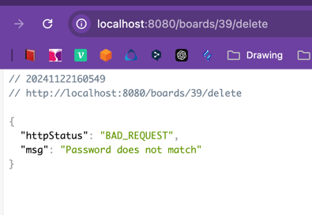

<!-- @import "[TOC]" {cmd="toc" depthFrom=1 depthTo=6 orderedList=false} -->

# SpringBoot 와 Mybatis 이용한 게시판

## :dizzy: 이전 Servlet 과 순수 JDBC 이용한 게시판과 달라진 점

### 1. Mybatis 적용 및 게시판 쿼리 최적화

- Mybatis 사용하여 커넥션 획득, 쿼리문 작성, 매핑을 수월하게 할 수 있었음
- 기존 게시판 조회 로직 (연관된 일대다 엔티티: 게시판 이미지, 게시판 첨부파일, 댓글)
    1. 게시판을 조회 (+1)
    2. 게시판 이미지 조회 (+1)
    3. 게시판 첨부파일 조회 (+1)
    4. 댓글 조회 (+1)
    5. 총 4개의 쿼리 발생
- 쿼리 최적화로 조인하여 하나의 쿼리로 호출
    - 네트워크 호출 비용 적지만, 쿼리 자체는 무거워짐(Distinct)
    - 만약 쿼리에서 가져오는 데이터가 많다면 한 번에 가져올 수 없음
  
```mysq3l
<select id = "findBoardDetailById" resultType="map">

SELECT b.id                                            as board_id,
       b.title                                         as board_title,
       b.content                                       as board_content,
       b.view_count                                    as board_view_count,
       DATE_FORMAT(b.created_at, '%Y-%m-%d')           as board_created_at,
       b.created_by                                    as board_created_by,
       DATE_FORMAT(b.updated_at, '%Y-%m-%d')           as board_updated_at,

       c.name                                          as category_name,

       GROUP_CONCAT(DISTINCT CONCAT_WS('|', bi.id, bi.stored_name, bi.stored_path,
                                       bi.extension))  AS board_images,

       GROUP_CONCAT(DISTINCT
                    CONCAT_WS('|', a.id, a.logical_name, a.stored_name, a.stored_path, a.extension,
                              a.size))                 AS attachments,

       GROUP_CONCAT(DISTINCT CONCAT_WS('|', cm.id, cm.content,
                                       DATE_FORMAT(cm.created_at, '%Y-%m-%d'),
                                       cm.created_by)) AS comments

FROM boards b
         LEFT JOIN
     categories c
     on
         c.id = b.category_id
         LEFT JOIN
     attachments a
     on
         b.id = a.board_id
         LEFT JOIN
     board_images bi
     on
         b.id = bi.board_id
         LEFT JOIN
     comments cm
     on
         b.id = cm.board_id
WHERE b.id = #{id}
</select>
```

### 2. 트랜잭션 고려

- 단순 조회가 아닌 추가, 변경 작업을 하는 메서드는 일관성 위해 트랜잭션 필요 (@Transactional)
- 트랜잭션 성공 후에 파일 입출력 등 트랜잭션과 상관없는 작업 분리, 트랜잭션 앞 뒤로 전처리 과정과 후처리 과정을 두어 트랜잭션 로직을 단순하게 함

```java
/**
 *
 *
 * <h1>게시판 수정 </h1>
 *
 * <br>
 * - 요청 검증 위해 먼저 게시판 상세 조회 쿼리 실행<br>
 * - 전처리 과정: 추가할 파일 상세 정보와 제거할 파일 경로 DTO 추가<br>
 * - 트랜잭션 성공 시 파일 시스템에 파일 추가 및 삭제<br>
 *
 * @return View
 */
@PostMapping("/boards/{id}")
public String updateBoard(
  @PathVariable Long id, @ModelAttribute ReqBoardPreUpdate reqBoardPreUpdate) {

  ResBoardDetail board = boardService.getBoard(id);

  ReqBoardUpdate reqBoardUpdate = boardService.preProcessUpdate(id, board, reqBoardPreUpdate);

  boardService.updateBoard(id, reqBoardUpdate);

  FileUtils.saveFile(reqBoardUpdate.getImages(), reqBoardUpdate.getImageDetails());
  FileUtils.saveFile(reqBoardUpdate.getAttachments(), reqBoardUpdate.getAttachmentDetails());
  FileUtils.deleteFile(reqBoardUpdate.getDeleteFilePaths());

  return Constants.REDIRECT_PREFIX + "/boards/" + id;
}
```

### 3. DAO 에서 View 의존성 낮춤

- DAO 에서 엔티티를 바라보고, View 의존성을 낮춤.
- 컨트롤러에서 쓰는 DTO를 반환하는 것도 장점이 크지만, 이번 프로젝트에서는 Converter를 두어 DAO가 View 에 대한 정보를 모르게 하고, Converter에서
  반환한 결과를 처리
    - View 가 변할때 DAO 변경 영향이 적다는 장점
    - 바인딩 에러 발생 (예를 들어, Exists 절은 tinyInt 반환되며, JDBC가 이를 Integer 또는 Long으로 불규칙하게 해석하는 문제 -> 타입 안정성
      별도로
      확보 필요)

#### BOARD_DAO

```java

@Mapper
public interface BoardMapper {

  void increaseViewCount(Long boardId);

  Map<String, Object> findBoardDetailById(Long id);

  long getTotalBoardCount(Map<String, Object> searchConditions);

  List<Map<String, Object>> getBoardList(Map<String, Object> searchConditions);

  void saveBoard(Board board);

  void updateBoard(Board board);

  void deleteBoardById(Long id);

  String getBoardPassword(Long id);
}
```

### 4. 환경변수 주입 & 로컬 및 테스트 환경 별도 구축

```yml
# application.yml
spring:
  datasource:
    driver-class-name: com.mysql.cj.jdbc.Driver

  mvc:
    view:
      prefix: /WEB-INF/
      suffix: .jsp

mybatis:
  mapper-locations: classpath:mapper/*.xml
  type-aliases-package: com.juny.jspboardwithmybatis.domain

# application-local.yml
spring:

  config:
    import: "classpath:env.properties"

  datasource:
    url: ${DB_LOCAL_URL}
    username: ${DB_LOCAL_USERNAME}
    password: ${DB_LOCAL_PASSWORD}

  web:
    resources:
      static-locations:
        - classpath:/static/
        - classpath:/public/
        - classpath:/resources/
        - classpath:/META-INF/resources/
        - ${RESOURCE_IMAGE_PATH}
        - ${RESOURCE_ATTACHMENT_PATH}
```

- application.yml 에는 공통 설정, application-local 에는 로컬 환경 설정함. 추후 배포 시 application-prod.yml 에서 환경변수
  주입하여 설정할 수 있도록 함

### 5. Global Exception Handler 적용

- Service 계층에서 예외는 BusinessException 상속하게 하여 한 번에 처리
- 특정 서비스 계층에서 예외가 발생한다면, 예외 중분류 계층을 두어 웹훅이나 특정 처리할 수 있는 구조
- ErrorCode 클래스에는 Http Status, 에러 코드, 에러 메시지 저장하여 클라이언트에게 특정 에러코드로 특정 작업 핸들링할 수 있게 함(ex: 액세스 토큰 만료 시
  토큰 재발행 로직 등)

#### ErrorCode

```java
public enum ErrorCode {
  INTERNAL_SERVER_ERROR(
    HttpStatus.INTERNAL_SERVER_ERROR,
    Constants.INTERNAL_SERVER_ERROR_CODE,
    ErrorMessage.INTERNAL_SERVER_ERROR_MSG),

  REQUEST_PARAMETER_INVALID(
    HttpStatus.BAD_REQUEST, Constants.INVALID_PARAM_CODE, ErrorMessage.INVALID_PARAMETER_MSG),

  PASSWORD_NOT_MATCH(
    HttpStatus.BAD_REQUEST, Constants.PASSWORD_NOT_MATCH_CODE,
    ErrorMessage.PASSWORD_NOT_MATCH),

  BOARD_NOT_FOUND(
    HttpStatus.BAD_REQUEST, Constants.BOARD_NOT_FOUND_CODE, ErrorMessage.BOARD_NOT_FOUND_MSG),

  ATTACHMENT_NOT_FOUND(
    HttpStatus.BAD_REQUEST,
    Constants.ATTACHMENT_NOT_FOUND_CODE,
    ErrorMessage.ATTACHMENT_NOT_FOUND_MSG);

  private final HttpStatus httpStatus;
  private final String code;
  private final String msg;
}
```

#### ErrorResponse

```java
import org.springframework.http.HttpStatus;

@Getter
public class ErrorResponse {

  private final HttpStatus httpStatus;
  private final String msg;

  public ErrorResponse(ErrorCode errorCode) {
    this.httpStatus = errorCode.getHttpStatus();
    this.msg = errorCode.getMsg();
  }

  public ErrorResponse(ErrorCode errorCode, String msg) {
    this.httpStatus = errorCode.getHttpStatus();
    this.msg = msg;
  }
}
```

#### GlobalExceptionHandler

```java

@RestControllerAdvice
public class GlobalExceptionHandler {

  /**
   *
   *
   * <h1>비지니스 예외를 상속받은 클래스 처리</h1>
   *
   * @param e
   * @return ErrorResponse
   */
  @ExceptionHandler(BusinessException.class)
  public ResponseEntity<ErrorResponse> handleBusinessException(BusinessException e) {

    return new ResponseEntity<>(
      new ErrorResponse(e.getErrorCode()), e.getErrorCode().getHttpStatus());
  }

  /**
   *
   *
   * <h1>비즈니스 예외가 아닌 것은 서버 에러(500)로 처리</h1>
   *
   * @param e
   * @return
   */
  @ExceptionHandler(Exception.class)
  public ResponseEntity<ErrorResponse> handle(Exception e) {

    e.printStackTrace();

    return new ResponseEntity<>(
      new ErrorResponse(ErrorCode.INTERNAL_SERVER_ERROR),
      ErrorCode.INTERNAL_SERVER_ERROR.getHttpStatus());
  }
}
```

