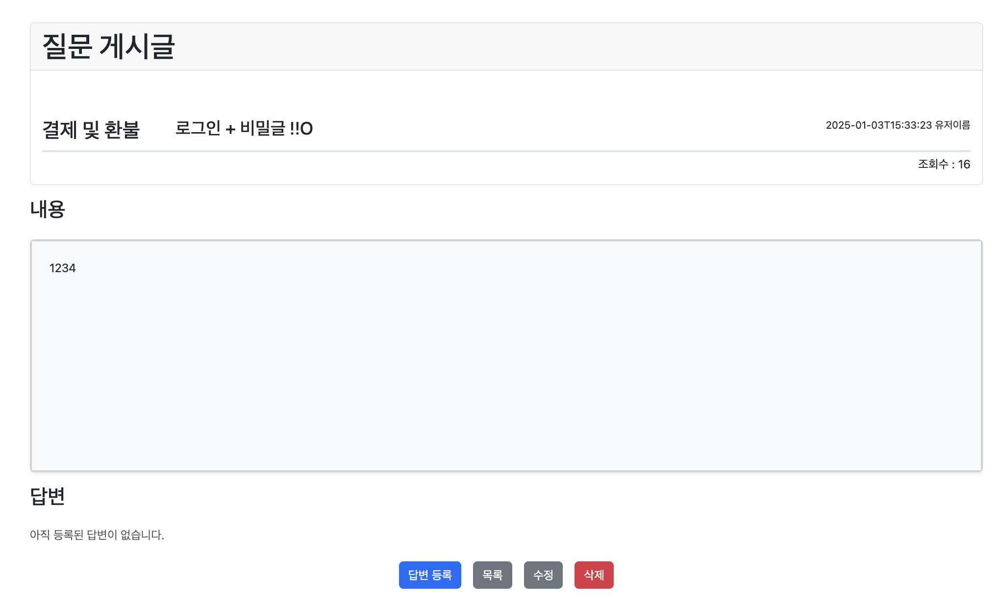

# 게시판 프로젝트

## Version
### 1. Servlet, 순수 JDBC, JSP
- 기본 게시판 CRUD 기능
  - 게시글 생성, 게시글 목록 조회, 게시글 상세 조회, 게시글 수정 및 삭제, 댓글 생성
  - 검색 조건(등록일, 카테고리, 검색어)
- 커맨드 패턴을 이용한 컨트롤러 확장 및 팩토리 메서드 패턴으로 의존성 한 곳에서 주입
- [링크](https://github.com/ji-jjang/ebrainsoft-study/tree/main/JspBoard)

### 2. SpringBoot, Mybatis, JSP
- 기본 게시판 CRUD 기능
- Mybatis 쿼리 개선(게시글 페이징 쿼리 시 일대다 엔티티(댓글, 첨부파일) concat으로 하나의 쿼리로 조회)
- 트랜잭션과 파일 I/O 분리
- GlobalExceptionHandler 적용 및 ErrorCode Enum 사용
- [링크](https://github.com/ji-jjang/ebrainsoft-study/tree/main/JspBoardWithMybatis)

### 3. SpringBoot, Mybatis, JSP & React
- 기본 게시판 CRUD 기능
- 로컬 개발 환경 및 Docker-Compose mysql, nginx, react 배포 환경 구성
- 컨트롤러에서 Mapper 로직, 서비스는 엔티티 반환하여 서비스 재사용성 증가
- Spring Bean Validation 및 Mapstruct 도입
- 페이지 이동한 뒤에도 검색 조건 URL 파라미터로 유지
- [링크](https://github.com/ji-jjang/ebrainsoft-study/tree/main/JspBoardWithMybatisAndReact)

### 4. 최종 SpringBoot, Mybatis, Thymeleaf, React
- 공지사항 게시판, 자유 게시판, 갤러리 게시판, 문의 게시판 CRUD 기능 및 페이지 구현 
- 사용자 페이지는 React, 관리자 페이지 ThymeLeaf 사용
- 사용자는 JWT 인증, 관리자는 세션 인증 방식 선택
- [링크](https://github.com/ji-jjang/ebrainsoft-study/tree/main/FinalBoard)

### 사용자 홈 화면

#### 1. 공지사항 게시판
- 관리자

- 사용자

>
1. 관리자만 게시글 생성, 수정 가능 
2. 상단 고정된 게시글은 가장 최근 생성일 기준으로 5개 노출

#### 2. 자유 게시판
- 관리자

- 사용자

>
1. 사용자, 관리자 게시글 생성, 조회, 수정, 삭제 가능 (사용자는 자신의 게시글만)
2. 사용자 첨부파일 등록, 댓글 등록 가능 (첨부파일 클릭 시 다운로드)

#### 3. 갤러리 게시판
- 관리자

- 사용자

>
1. 사용자, 관리자 게시글 생성, 조회, 수정, 삭제 가능 (사용자는 자신의 게시글만)
2. 사용자 이미지 등록 가능 (수정에서 클릭 시 다운로드)
3. 사용자는 자신의 게시글만 수정, 삭제 버튼 보이고 삭제 가능

#### 4. 문의 게시판
- 관리자

- 사용자

>
1. 로그인 하지 않은 사용자도 문의글 작성 가능 (비밀글 가능)
2. 로그인 하지 않은 사용자, 비밀글 일 때 비밀번호 입력하고 조회 가능
3. 로그인 하지 않은 비밀글이 아닌 경우 수정, 삭제일 경우 비밀번호 입력하고 수정, 삭제할 수 있도록
4. 로그인한 사용자가 작성한 글은 자신이 작성한 글만 조회, 수정, 삭제 가능
5. 관리자는 어떤 게시물이건 조회, 수정, 삭제 가능

# ETC
- 간단한 HTTP 파서(https://github.com/ji-jjang/ebrainsoft-study/tree/main/SimpleHttpParser)
- React 빙고 게임(https://github.com/ji-jjang/ebrainsoft-study/tree/main/BingoGame)
