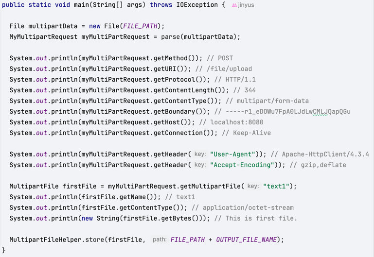
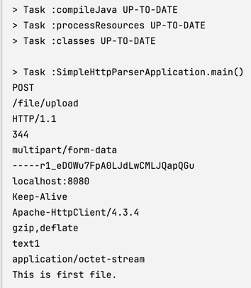

# HTTP 프로토콜 이해를 위한 실습
```bash
POST /file/upload HTTP/1.1
Content-Length: 344
Content-Type: multipart/form-data; boundary=-----r1_eDOWu7FpA0LJdLwCMLJQapQGu
Host: localhost:8080
Connection: Keep-Alive
User-Agent: Apache-HttpClient/4.3.4 (java 1.5)
Accept-Encoding: gzip,deflate

-------r1_eDOWu7FpA0LJdLwCMLJQapQGu
Content-Disposition: form-data; name=text1; filename=uploadFile1.txt
Content-Type: application/octet-stream

This is first file.
-------r1_eDOWu7FpA0LJdLwCMLJQapQGu
Content-Disposition: form-data; name=text2; filename=uploadFile2.txt
Content-Type: application/octet-stream

This is second file.
-------r1_eDOWu7FpA0LJdLwCMLJQapQGu--


```
- HTTP 요청 메시지를 파싱하는 것 
- 멀티 파트 요청을 받아 헤더의 각 내용을 출력하고, 멀티파트파일을 읽어 특정 경로에 저장하기



